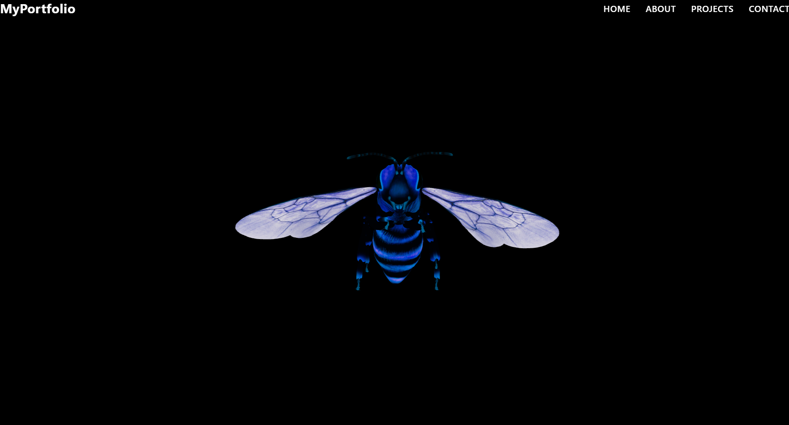
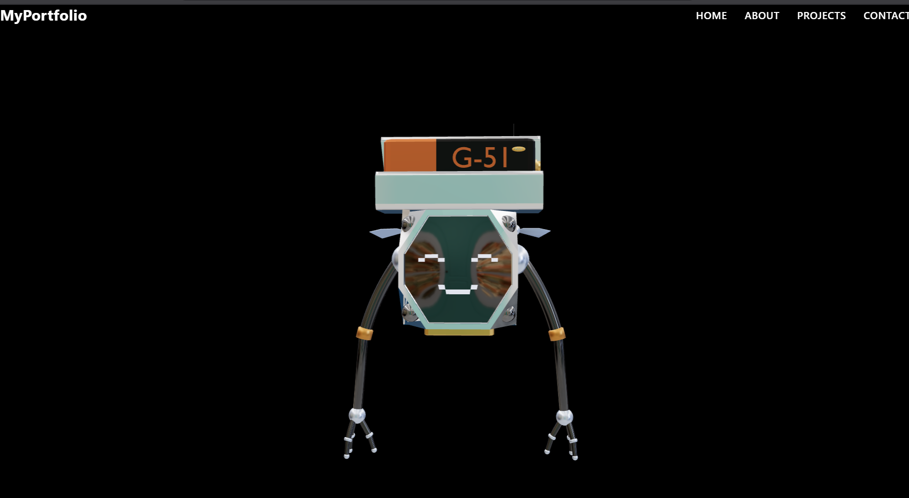
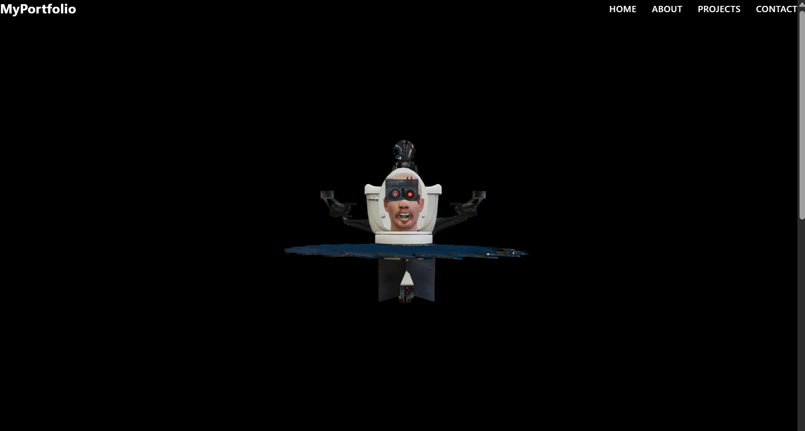

# 🧠 3D Model Viewer with Animation & HDRI | Three.js + GSAP

A lightweight, responsive 3D model viewer built with **Three.js**, **GLTFLoader**, **GSAP** for smooth mouse interaction, and **HDRI lighting**. Easily view animated `.glb` models with support for rotation and reflections.

## 🖼️ Quick Preview

| Model          | Preview                                   |
| -------------- | ----------------------------------------- |
| Flying Skibidi |  |
| Flying Robot   |          |
| Monster Boss   |           |

---

## 📸 Demo Videos

### 🚀 Skibidi Flying Saw

## <video autoplay loop muted src="https://raw.githubusercontent.com/IamNishant51/3D-Model-Viewer/main/assets/skibidi_flying_saw.mp4" width="500"></video>

### 🤖 Flying Robot

## <video autoplay loop muted src="https://raw.githubusercontent.com/IamNishant51/3D-Model-Viewer/main/assets/flying_robot.mp4" width="500"></video>

### 👻 Monster Boss

## <video autoplay loop muted src="https://raw.githubusercontent.com/IamNishant51/3D-Model-Viewer/main/assets/flying_monster.mp4" width="500"></video>

## ✨ Features

- ✅ Drag-to-rotate (mouse-based)
- ✅ Smooth GSAP rotation animation
- ✅ `.glb` animation playback via AnimationMixer
- ✅ Environment lighting using `.exr` HDRI
- ✅ Auto-centering & smart scaling for any 3D model
- ✅ Easily change models from the `public/` folder

---

## 📁 Folder Structure
